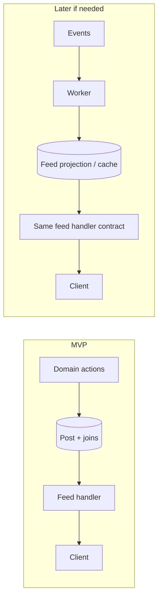

# River Architecture — System Design

This document describes the **River** feed: home-page chronology, content pipeline, and API contract. It supersedes scope discussions for MVP; social engagement depth remains in `RIVER_SOCIAL_ROADMAP.md` (phase 2).

---

## 1. Goals

| Goal | MVP | Later |
|------|-----|--------|
| Single read feed on the app home page | Yes | — |
| Vendors motivated to post | Minimal manual composer | Rich editor, scheduling |
| Automated surfacing of new stores / products | Yes (system-generated cards) | More event types |
| One logical post type, multiple UI layouts | Yes (`layout` discriminant) | Additional layouts |
| Likes, comments, shares | Hidden or read-only counts only if already in DB | Full engagement UX + APIs |

---

## 2. Conceptual Model

The River is an **ordered list of feed items** (not raw chronological time order — see §3.1). Each item has:

- **Actor** — who the card represents (store or system).
- **Presentation** — `layout` + optional title, body, media.
- **Attribution** — optional links to `storeId` / `itemId` for CTAs and deep links.
- **Provenance** — how the row was created (`manual` vs automation kinds), for analytics and moderation.
- **Priority** — integer, default `0`; higher sorts first. Enables manual curation, featured slots, and future “promoted” rows **without** building a ranking or relevance engine.

Persistence today maps closely to `Post` (`storeId`, `content`, `mediaUrls`, …). Add **`priority Int @default(0)`** plus columns for `layout`, `source`, and optional `layoutPayload` without splitting into many tables for MVP.

---

## 3. Read Path vs Write Path

### 3.1 Read path (MVP)

- **Source of truth**: relational DB (`Post` + joins to `Store`, and optionally `Item` when linking products).

**Ordering (minimal control, not a “ranking system”)**

Plain `ORDER BY createdAt DESC` is correct for a naive timeline but **breaks UX quickly**: bursts of new stores, noisy automation, and low-signal posts dominate; ops has no lever without deploying ML.

Use **one scalar**:

| Field | Default | Role |
|-------|---------|------|
| `priority` | `0` | Higher = nearer the top. Manual curation, featured stories, later ad slots — same mechanism. |

**Sort:**

```sql
ORDER BY priority DESC, createdAt DESC, id DESC
```

(`id` tie-breaks stable ordering when `priority` and `createdAt` match.)

**Pagination:** opaque cursor must encode the last row’s `(priority, createdAt, id)` (or equivalent) so pages stay stable when new rows insert above the cursor. Do not cursor on `createdAt` alone once `priority` exists.

- **Response**: stable **wire shape** (`RiverFeedItem`) — see §6. The server maps rows to that shape; clients never depend on raw Prisma field names.

### 3.2 Write path

| Writer | Behavior |
|--------|----------|
| Vendor / admin UI | Creates or updates a manual post associated with a store. |
| Automation (onboarding, catalog) | Same table: insert a post row when a store or product becomes eligible (e.g. after commit of `Store` / `Item` create). Optionally attribute `source = auto_store` / `auto_product`. |

All writes remain **synchronous with the business transaction** until volume or enrichment requirements justify async processing.

### 3.3 Pipeline evolution



**Rule:** Implement MVP as **DB read + direct inserts**. Introduce a **worker + denormalized feed store** only when justified (throughput, multi-source fusion, heavy enrichment, pinning). The **HTTP contract in §6 stays stable** so the client does not change when the backend swaps implementation.

---

## 4. Layout System

- **One persisted post type**; **layout** selects the React (or native) presentation.
- **Default layout — `instagram_basic`**: optional title, primary media stack, body paragraph. Aligns with existing `content` + `mediaUrls` JSON.
- **Extensibility**: add enum values and optional `layoutPayload` (JSON) for layout-specific fields without new tables for each variant.

---

## 5. Automation (MVP)

**Triggers (what we insert)**

- **New vendor**: after store reaches an eligible state (e.g. **published**, not draft), insert `Post` with `source = auto_store`, `priority = 0` unless ops sets higher, copy/media from branding when present, `links.storeId` set.
- **New product**: after item is **listed/published**, insert with `source = auto_product`, `links.itemId` + hero media when available.

Triggers live next to the real create/publish flows so behavior stays consistent with domain rules.

**Guardrails (required — “insert on create” is dangerous without them)**

| Risk | Guardrail |
|------|-----------|
| Duplicate flood | **Idempotency**: at most one `auto_store` welcome post per `storeId` — enforced by **`automationKey`** default `auto_store:{storeId}` (unique) + idempotent return on conflict. **`AUTO_PRODUCT`**: at most one per store per **`RIVER_AUTO_PRODUCT_COOLDOWN_HOURS`** (see `packages/db/src/services/river.constants.ts`). Per-item idempotency still uses **`automationKey`** when you set it (e.g. per `itemId`). |
| Empty automation | **Non-empty `mediaUrls`** required for any non-`MANUAL` `createPost`; API returns **409** if violated. |
| Feed readability | **`GET /river/feed`** omits posts with **empty `media`** unless **`allowEmptyMedia=true`**. |
| Catalog import bursts | **Batch creates**: do not emit one River post per SKU on bulk import; **debounce**, **digest** (single “new arrivals” post), or **cap** posts per job. |
| Feed spam | **Per-store rate limit**: e.g. max *N* `auto_product` posts per store per **day** (config); oldest-over or drop with metric. Optional **global** cap on automation rows per hour for safety. |
| Wrong lifecycle | Fire only on **publish** (or your canonical “visible” transition), not on draft save or internal fixtures. |
| Empty noise | Skip automation if required presentation is missing (e.g. no title/media when policy says both required); log and metric. |
| Bad actors / test accounts | Optional: only auto-post when store/item passes **minimum quality gates** (e.g. profile complete, not sandbox). |

Together with **`priority`**, ops can **pull up** important manual or featured content without deleting automation rows; automation stays at `0` unless product rules say otherwise.

---

## 6. API Contract (Phase 1 — client-stable)

**Endpoint (implemented):** `GET /river/feed` — cursor pagination, `ORDER BY priority DESC, createdAt DESC, id DESC`.

**Location (implemented):** optional **`lat`**, **`lng`** (must appear together), **`radiusMiles`** (default 25). Filters to stores within great-circle distance using **`Store.latitude` / `Store.longitude`** (published stores). Connects the feed to the same coordinates you use for **`LocationService`** / map UX on the client.

**Legacy list:** `GET /river/posts` remains page-based; it now respects the same priority ordering for `sortBy=recent`, restricts to **published** stores, and exposes `priority`, `layout`, `source`, `linkedItemId` on each row.

**Curation (API foundation):** `PATCH /river/posts/:id` with `{ priority }` — admin/vendor UI still TBD.

**Query parameters**

| Param | Description |
|-------|-------------|
| `cursor` | Opaque; omit for first page |
| `limit` | Page size; server caps (e.g. max 50) |
| `lat`, `lng` | Optional pair; geo-filtered feed when both set |
| `radiusMiles` | Optional; default 25 when geo active |
| `allowEmptyMedia` | Optional; when `true`, include posts with no media |

**Response**

```typescript
type RiverFeedPage = {
  items: RiverFeedItem[];
  nextCursor: string | null;
};

type RiverFeedItem = {
  id: string;
  createdAt: string; // ISO 8601

  /** Echo of DB sort key; default 0. UI may show “featured” when > 0. */
  priority: number;

  layout: 'instagram_basic' | string;

  actor: {
    kind: 'store' | 'system';
    storeId?: string;
    displayName: string;
    avatarUrl?: string;
  };

  title: string | null;
  body: string | null;

  media: Array<{
    type: 'image' | 'video';
    url: string;
    thumbnailUrl?: string;
    width?: number;
    height?: number;
  }>;

  /** Optional until productized; useful for analytics and badges */
  source?: 'manual' | 'auto_store' | 'auto_product';

  links?: {
    storeId?: string;
    itemId?: string;
  };
};
```

Engagement mutations are **out of scope** for this contract until phase 2; existing DB counters (`likesCount`, etc.) may still be mapped read-only if needed.

---

## 7. Client Responsibilities

- Single hook or API module: `getRiverFeed({ cursor, limit })` returning `RiverFeedPage`.
- Home page consumes **only** `RiverFeedItem`; layout components branch on `layout`.
- Types shared with the server via OpenAPI/codegen or a shared package as per repo conventions.

---

## 8. Non-Goals (MVP)

- Personalized **ML ranking** / trending scores / following graph — `priority` is manual and scalar, not learned.
- Comments, likes, shares as interactive features (see `RIVER_SOCIAL_ROADMAP.md`).
- Separate microservice for River; MVP stays in the monolith API.

---

## 9. Document Map

| Document | Role |
|----------|------|
| **RIVER_ARCHITECTURE.md** (this file) | MVP system design, pipeline stance, API contract |
| **RIVER_DEVELOPER_GUIDE.md** | Repo paths, APIs, types, pipeline implementation notes |
| **RIVER_SOCIAL_ROADMAP.md** | Broader social/commerce features and later phases |
